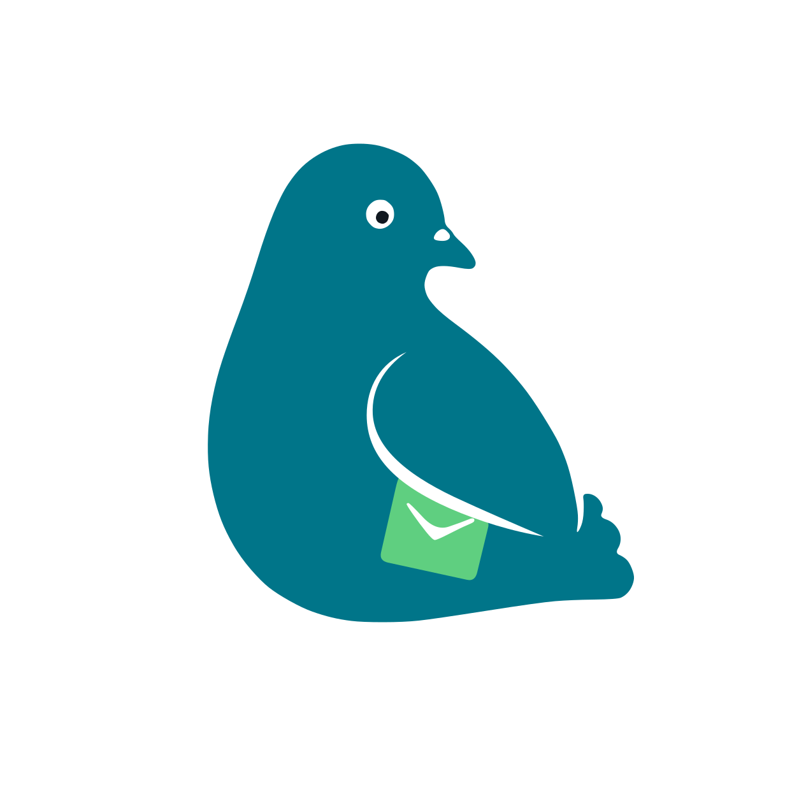

<div align="center">
  
  <h1>Packet Pigeon</h1>
  <p><em>Give AI agents the power to read and act through email.</em></p>
  <p>English · <a href="README.zh-Hant.md" lang="zh-Hant">繁體中文</a></p>
</div>

**Packet Pigeon** is a Cloudflare Worker that receives inbound mail via Email Routing, archives the raw MIME to R2, then parses it asynchronously via Queues.

## How it works

```text
Sender ─▶ Email Routing ─▶ Worker email() ─▶ R2 raw.eml
                                              ─▶ Queue ─▶ Worker queue() ─▶ R2 parsed output
```

- `email()` streams `message.raw` straight to R2 with `FixedLengthStream(message.rawSize)`, tagging it with `emailId` (UUIDv7), envelope from/to, and receipt timestamp. Nothing is parsed on the hot path.
- R2 object-creation notifications are forwarded to the `packet-pigeon-email-parse` queue.
- `queue()` re-reads the `.eml` from R2, parses it with `postal-mime`, and writes the extracted HTML body and attachments back to R2.

## Storage layout

```text
emails/
└── {emailId}/
    ├── raw.eml
    ├── body.html                  # only when the message has an HTML part
    └── attachments/
        └── {ordinal}/{filename}
```

`raw.eml` carries `emailId`, `envelopeFrom`, `envelopeTo`, and `workerReceivedAt` as R2 custom metadata. Attachment filenames are sanitized (`/ \ : * ? " < > |` and control chars become `_`); a missing filename falls back to `untitled`.

## Deployment & configuration

Required: an R2 bucket (`packet-pigeon`), a queue (`packet-pigeon-email-parse`) wired to R2 event notifications, and an Email Routing address pointing at the Worker (e.g. `ai@agent.asyncat.app`).

```bash
npm install
npm run deploy
```

## Development

Requirements: Node.js 22+ and a logged-in Wrangler CLI.

```bash
npm install
npm run dev
```
